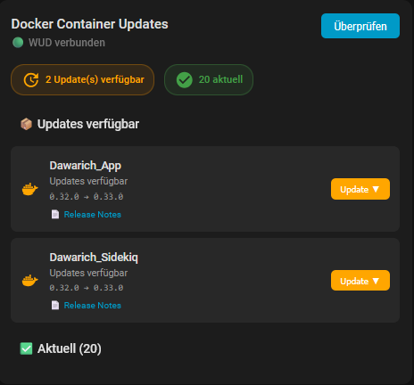
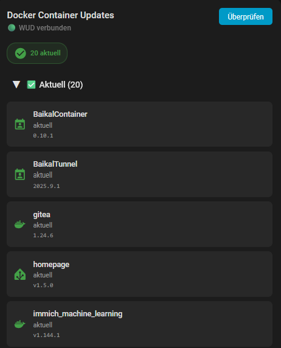
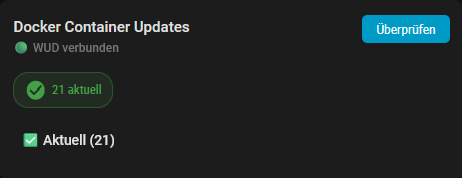
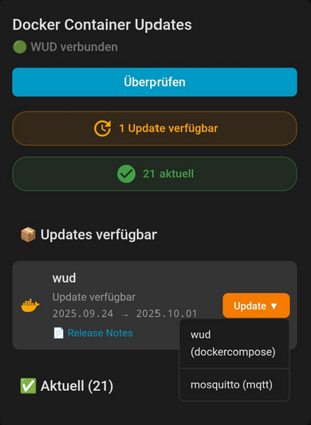

# What\'s up Docker Card for Home Assistant

A custom Lovelace card for Home Assistant that displays Docker container updates and integrates with [What's Up Docker (WUD)](https://github.com/fmartinou/whats-up-docker) to trigger updates directly from the UI.

[](https://github.com/custom-components/hacs)

## Features

- Display available container updates from Home Assistant update entities
- Trigger container updates via WUD API
- Multi-language support (English, German)
- Customizable icons per container
- Release notes links with template support
- Collapsible sections for better overview
- Responsive design for mobile devices

## Screenshots






## Installation

### HACS (Recommended)

1. Open HACS in Home Assistant
2. Click on "Frontend"
3. Click the 3-dot menu in the top right corner
4. Click "Custom repositories"
5. Add this repository URL: `https://github.com/angryvoegi/wud-card`
6. Select category: "Dashboard"
7. Click "Add"
8. Find "What\'s Up Docker Card" in the list and click "Install"
9. Refresh the frontend

### Manual Installation

1. Download `wud-card.js` 
2. Copy it to `www/wud-card.js`
3. Add the following to your `configuration.yaml`:

```yaml
lovelace:
  resources:
    - url: /local/wud-card.js
      type: module
```

4. Restart Home Assistant

## Configuration

### Minimal Configuration

```yaml
type: custom:wud-card
```

### Full Configuration Example

```yaml
type: custom:wud-card
title: Docker Container Updates
entity_filter:
  - whats_up_docker
  - wud_container
show_current: true
show_available_updates: true
current_collapsed: true
update_interval: 30000
wud_api:
  url: http://your-wud-instance:3000
  show_update_buttons: true
  auth: your_bearer_token_here
release_notes:
  home-assistant: https://github.com/home-assistant/core/releases/tag/{latest}
  traefik: https://github.com/traefik/traefik/releases/tag/v{latest}
  nginx: https://nginx.org/en/CHANGES-{version}
custom_icons:
  plex: mdi:plex
  jellyfin: mdi:jellyfin
  frigate: mdi:cctv
```

Only set the auth bearer token if you need to authenticate with WUD.
### Configuration Options

| Option                        | Type            | Default                                | Description                                                 |
|-------------------------------|-----------------|----------------------------------------|-------------------------------------------------------------|
| `title`                       | string          | Auto (translated)                      | Card title                                                  |
| `entity_filter`               | string or array | `['whats_up_docker', 'wud_container']` | Filter for update entities which are generated by Mosquitto |
| `show_current`                | boolean         | `true`                                 | Show up-to-date containers                                  |
| `show_available_updates`      | boolean         | `true`                                 | Show containers with available updates                      |
| `current_collapsed`           | boolean         | `true`                                 | Initially collapse the up-to-date section                   |
| `update_interval`             | number          | `30000`                                | Interval in ms to refresh WUD data                          |
| `wud_api.url`                 | string          | -                                      | URL of your WUD instance                                    |
| `wud_api.show_update_buttons` | boolean         | `true`                                 | Show update buttons                                         |
| `wud_api.auth`                | string          | -                                      | Bearer token for WUD API authentication                     |
| `release_notes`               | object          | `{}`                                   | Template URLs for release notes (see below)                 |
| `custom_icons`                | object          | `{}`                                   | Custom MDI icons per container name                         |

### Release Notes Templates

You can configure release notes links with placeholders:

- `{installed}` - Currently installed version
- `{latest}` - Latest available version
- `{version}` - Alias for `{latest}`
- `{name}` - Container name

**Examples:**

```yaml
release_notes:
  # Release notes for new version:
  ntfy: https://github.com/binwiederhier/ntfy/releases/tag/v{version}
```

Make sure to match the pattern for the releases url (e.g. with a `v` prefix depending on the repository)

### Custom Icons

Map container names to Material Design Icons:

```yaml
custom_icons:
  plex: mdi:plex
  jellyfin: mdi:jellyfin
  homeassistant: mdi:home-assistant
  frigate: mdi:cctv
  prometheus: mdi:chart-line
```

## What's Up Docker Integration

This card works best with the [What's Up Docker integration](https://github.com/custom-components/whats_up_docker) for Home Assistant.

### Prerequisites

1. Install and configure WUD: https://github.com/fmartinou/whats-up-docker
2. Configure WUD to push updates to MQTT (Mosquitto) and configure WUD in your Home Assistant instance
3. Configure triggers in WUD (e.g., docker compose)

### WUD Configuration Example


```yaml
# docker-compose.yml for WUD
services:
  whatsupdocker:
    image: getwud/wud:8.1.1
    container_name: wud
    ports:
      - "3000:3000"
    user: "0:0"
    volumes:
      - /var/run/docker.sock:/var/run/docker.sock
      - /PATH/TO/YOUR/CONTAINER/WUD/docker-compose.yml:/wud/docker-compose.yml
      - /PATH/TO/YOUR/CONTAINER/Vaultwarden/docker-compose.yml:/compose/vaultwarden.yml
    environment:
      - WUD_SERVER_CORS_ENABLED=true
      - WUD_SERVER_CORS_ORIGIN=*
      - WUD_SERVER_CORS_METHODS=GET,HEAD,PUT,PATCH,POST,DELETE

      - WUD_TRIGGER_DOCKERCOMPOSE_DEFAULT_EXCLUDE=true
      - WUD_TRIGGER_DOCKERCOMPOSE_WUD_FILE=/wud/docker-compose.yml

      - WUD_TRIGGER_DOCKERCOMPOSE_VAULTWARDEN_FILE=/compose/vaultwarden.yml
      - WUD_TRIGGER_DOCKERCOMPOSE_VAULTWARDEN_THRESHOLD=minor
      - WUD_TRIGGER_DOCKERCOMPOSE_VAULTWARDEN_DRYRUN=false
    labels:
      - wud.tag.include=^\d+\.\d+\.\d+$
      - wud.trigger.include=dockercompose.wud,mqtt.mosquitto
```

NOTE: Enable CORS for WUD API depending on your setup.
Add the labels `wud.tag.include` and `wud.trigger.include` to your *Container to watch* docker-compose file. Check the [documentation](https://getwud.github.io/wud/#/configuration/) of WUD
for more information.

## Language Support

The card automatically detects your Home Assistant language setting and displays in:
- English (default)
- German

To add more languages, edit the `TRANSLATIONS` object in `wud-card.js`.

## Default Icon Mappings

The card includes built-in icon mappings for common containers:

- Traefik → `mdi:router-network`
- Mosquitto → `mdi:message-outline`
- Default → `mdi:docker`

## Troubleshooting

### WUD not connecting

1. Verify the WUD URL is correct and accessible from Home Assistant
2. Check if authentication token is needed and configured
3. Look for errors in the browser console (F12)

### No containers shown

1. Verify your `entity_filter` matches your update entity IDs
2. Check if the entities exist in Developer Tools → States
3. Ensure entities start with `update.`

### Updates not triggering

1. Verify WUD triggers are configured correctly
2. Check WUD logs for errors
3. Ensure the container is managed by WUD

## Contributing

Contributions are welcome! Please feel free to submit a Pull Request.

## License

MIT License - see [LICENSE](LICENSE) file for details

## Credits

- Inspired by various Home Assistant custom cards
- Built for integration with [What's Up Docker](https://github.com/fmartinou/whats-up-docker)
- Claude
