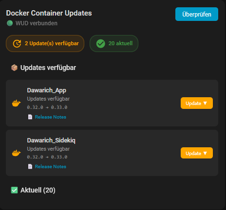
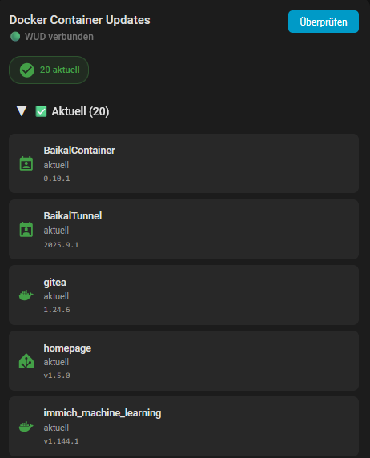
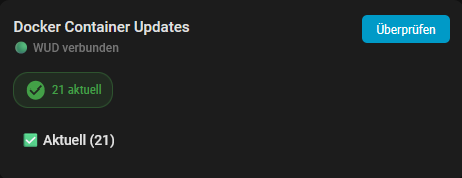
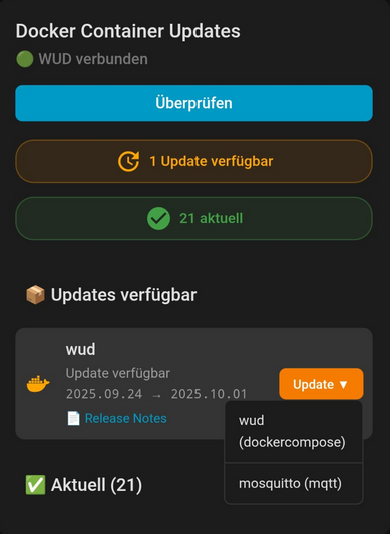

# What's up Docker Card for Home Assistant

A custom Lovelace card for Home Assistant that displays Docker container updates and integrates with [What's Up Docker (WUD)](https://github.com/fmartinou/whats-up-docker) to trigger updates directly from the UI.

[](https://github.com/custom-components/hacs)

## Features

- Display available container updates from Home Assistant update entities
- Works with both **MQTT** and **HTTP** WUD integrations
- Trigger container updates via WUD API
- Skip updates to defer them to a separate collapsible section
- Container names resolved from HA `friendly_name`
- Multi-language support (English, German)
- Customizable icons per container
- Release notes links with template support
- Collapsible up-to-date and skipped sections
- Responsive design for mobile devices

## Screenshots






## Installation

### HACS (Recommended)

1. Open HACS in Home Assistant
2. Click on "Frontend"
3. Click the 3-dot menu in the top right corner
4. Click "Custom repositories"
5. Add this repository URL: `https://github.com/angryvoegi/wud-card`
6. Select category: "Dashboard"
7. Click "Add"
8. Find "What's Up Docker Card" in the list and click "Install"
9. Refresh the frontend

### Manual Installation

1. Download `wud-card.js`
2. Copy it to `www/wud-card.js`
3. Add the following to your `configuration.yaml`:

```yaml
lovelace:
  resources:
    - url: /local/wud-card.js
      type: module
```

4. Restart Home Assistant

## Configuration

### Minimal Configuration

```yaml
type: custom:wud-card
```

### Full Configuration Example

```yaml
type: custom:wud-card
title: Docker Container Updates
entity_filter:
  - whats_up_docker
  - wud_container
prefixes:
  - local
show_current: true
show_available_updates: true
current_collapsed: true
enable_skip: true
update_interval: 30000
wud_api:
  url: http://your-wud-instance:3000
  api_path: /api/v1                    # Optional; auto-detects /api/v1 then /api when omitted
  show_update_buttons: true
  auth: your_bearer_token_here         # Bearer token (takes priority)
  user: your_username                  # Basic auth (used if auth is not set)
  password: your_password
  trigger_filter: all
release_notes:
  home-assistant: https://github.com/home-assistant/core/releases/tag/{latest}
  traefik: https://github.com/traefik/traefik/releases/tag/v{latest}
  nginx: https://nginx.org/en/CHANGES-{version}
custom_icons:
  plex: mdi:plex
  jellyfin: mdi:jellyfin
  frigate: mdi:cctv
```

### Configuration Options

| Option                        | Type            | Default                                    | Description                                                        |
|-------------------------------|-----------------|--------------------------------------------|--------------------------------------------------------------------|
| `title`                       | string          | Auto (translated)                          | Card title                                                         |
| `entity_filter`               | string or array | `['whats_up_docker', 'wud_container']`     | Substring filter for update entity IDs                             |
| `prefixes`                    | string or array | `['local']`                                | WUD host/stack prefixes to strip when falling back to entity ID    |
| `show_current`                | boolean         | `true`                                     | Show up-to-date containers                                         |
| `show_available_updates`      | boolean         | `true`                                     | Show containers with available updates                             |
| `current_collapsed`           | boolean         | `true`                                     | Initially collapse the up-to-date section                          |
| `enable_skip`                 | boolean         | `false`                                    | Show a Skip button on each pending update (see below)              |
| `update_interval`             | number          | `30000`                                    | Interval in ms to refresh WUD API data                             |
| `wud_api.url`                 | string          | —                                          | URL of your WUD instance                                           |
| `wud_api.api_path`            | string          | Auto (`/api/v1`, then `/api`)              | API base path override (`/api` for legacy WUD servers)             |
| `wud_api.show_update_buttons` | boolean         | `true`                                     | Show update trigger buttons                                        |
| `wud_api.auth`                | string          | —                                          | Bearer token for WUD API authentication                            |
| `wud_api.user`                | string          | —                                          | Username for WUD Basic authentication                              |
| `wud_api.password`            | string          | —                                          | Password for WUD Basic authentication                              |
| `wud_api.trigger_filter`      | string or array | `all`                                      | Limit triggers by type or name, e.g. `dockercompose`, `mqtt`       |
| `release_notes`               | object          | `{}`                                       | Template URLs for release notes (see below)                        |
| `custom_icons`                | object          | `{}`                                       | Custom MDI icons per container name                                |

### Skip Updates

Enable the skip feature with `enable_skip: true`. A **Skip** button then appears below the Update button on every pending update (same size, column layout — no change in row height).

```yaml
type: custom:wud-card
enable_skip: true
```

**How it works:**

- **Skip** — moves the container out of *Updates Available* into a collapsible **Skipped Updates** section
- **Unskip** — moves it back to *Updates Available* without triggering an update
- **Update** (from the skipped section) — triggers the update and automatically unskips the container

The skipped state is stored in `localStorage` and persists across page reloads. The summary row shows a separate chip with the number of skipped containers.

### Authentication

Only one method is used at a time. Bearer token (`auth`) takes priority over Basic auth (`user` + `password`).

### Container Name Resolution

The card resolves container display names in this priority order:

1. **`friendly_name` from the HA entity** — this is set by WUD via MQTT or the HA integration and respects `wud.display.name` labels. Always correct.
2. **WUD API container name** — used if the WUD API is configured and the container is matched.
3. **Entity ID fallback** — strips well-known prefixes and humanises the remainder. Used only when the above two are unavailable.

This means even without the WUD API configured, container names will display correctly as long as the HA entities have a `friendly_name` — which they always do when using the WUD MQTT or HTTP integration.

### Release Notes Templates

Configure per-container release notes links using placeholders:

| Placeholder    | Value                            |
|----------------|----------------------------------|
| `{installed}`  | Currently installed version      |
| `{latest}`     | Latest available version         |
| `{version}`    | Alias for `{latest}`             |
| `{name}`       | Container name                   |

**Example:**

```yaml
release_notes:
  ntfy: https://github.com/binwiederhier/ntfy/releases/tag/v{version}
  traefik: https://github.com/traefik/traefik/releases/tag/v{latest}
```

> Note the URL pattern varies per project (some use a `v` prefix, some don't). Check the repository's releases page.

### Custom Icons

Map container names to [Material Design Icons](https://pictogrammers.com/library/mdi/):

```yaml
custom_icons:
  plex: mdi:plex
  jellyfin: mdi:jellyfin
  homeassistant: mdi:home-assistant
  frigate: mdi:cctv
  prometheus: mdi:chart-line
```

Matching is case-insensitive and substring-based (e.g. `traefik` matches a container named `traefik-proxy`).

#### Built-in icon mappings

| Container    | Icon                  |
|--------------|-----------------------|
| `traefik`    | `mdi:router-network`  |
| `mosquitto`  | `mdi:message-outline` |
| *(default)*  | `mdi:docker`          |

## What's Up Docker Integration

This card works with the [What's Up Docker integration](https://github.com/custom-components/whats_up_docker) for Home Assistant, via either **MQTT** or **HTTP API**.

### Prerequisites

1. Install and configure WUD: https://github.com/fmartinou/whats-up-docker
2. Connect WUD to Home Assistant via MQTT or the HA integration
3. *(Optional)* Configure WUD triggers (docker compose, watchtower, etc.) to enable update buttons

### WUD Docker Compose Example

```yaml
services:
  whatsupdocker:
    image: getwud/wud:8.1.1
    container_name: wud
    ports:
      - "3000:3000"
    user: "0:0"
    volumes:
      - /var/run/docker.sock:/var/run/docker.sock
      - /PATH/TO/YOUR/WUD/docker-compose.yml:/wud/docker-compose.yml
      - /PATH/TO/YOUR/app/docker-compose.yml:/compose/app.yml
    environment:
      # Enable CORS so the card can reach the WUD API from the browser
      - WUD_SERVER_CORS_ENABLED=true
      - WUD_SERVER_CORS_ORIGIN=*
      - WUD_SERVER_CORS_METHODS=GET,HEAD,PUT,PATCH,POST,DELETE

      # Trigger: update WUD itself via docker compose
      - WUD_TRIGGER_DOCKERCOMPOSE_DEFAULT_EXCLUDE=true
      - WUD_TRIGGER_DOCKERCOMPOSE_WUD_FILE=/wud/docker-compose.yml

      # Trigger: update a specific app
      - WUD_TRIGGER_DOCKERCOMPOSE_APP_FILE=/compose/app.yml
      - WUD_TRIGGER_DOCKERCOMPOSE_APP_THRESHOLD=minor
      - WUD_TRIGGER_DOCKERCOMPOSE_APP_DRYRUN=false
    labels:
      - wud.tag.include=^\d+\.\d+\.\d+$
      - wud.trigger.include=dockercompose.wud,mqtt.mosquitto
```

> Add `wud.tag.include` and `wud.trigger.include` labels to the containers you want to watch. See the [WUD documentation](https://getwud.github.io/wud/#/configuration/) for all options.

## Language Support

The card automatically uses your Home Assistant language setting:

- English (default)
- German

To add more languages, extend the `TRANSLATIONS` object in `wud-card.js` (and kindly open a pull request).

## Troubleshooting

### Container names are wrong or show the entity ID

The card reads `friendly_name` from the HA entity first. If names are wrong, check:

1. Open **Developer Tools → States** and find your `update.*` entity
2. Confirm `friendly_name` is set correctly in the entity attributes
3. If using MQTT: verify WUD publishes the correct name (check `wud.display.name` label on the container)

### No containers shown

1. Check **Developer Tools → States** for entities starting with `update.`
2. Confirm the entity IDs contain one of the strings in your `entity_filter`
3. Default filter matches `whats_up_docker` and `wud_container` — adjust if your entity IDs differ

### WUD API not connecting

1. Verify the WUD URL is reachable from the browser (not just from HA server)
2. Enable CORS in WUD (`WUD_SERVER_CORS_ENABLED=true`)
3. Check authentication configuration (Bearer token or Basic auth)
4. Open browser DevTools (F12) → Network tab for detailed errors

### Update buttons not appearing

1. Set `wud_api.show_update_buttons: true` in config
2. Verify WUD triggers are configured and the card can reach the API (green status indicator)
3. Check `trigger_filter` — if set to a specific type, only matching triggers are shown

## Contributing

Contributions are welcome! Please feel free to submit a Pull Request.

## License

MIT License — see [LICENSE](LICENSE) file for details

## Credits

- Built for integration with [What's Up Docker](https://github.com/fmartinou/whats-up-docker)
- Inspired by various Home Assistant custom cards
- Made with AI (Claude)
